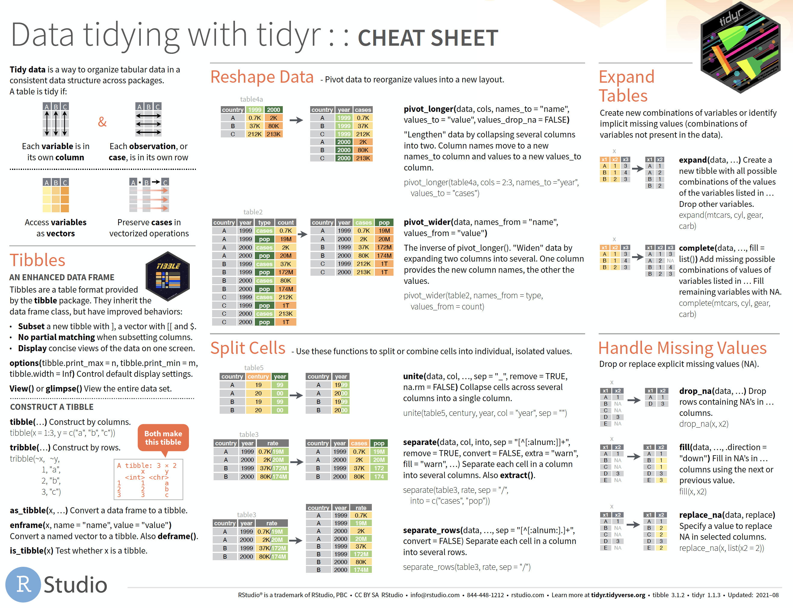
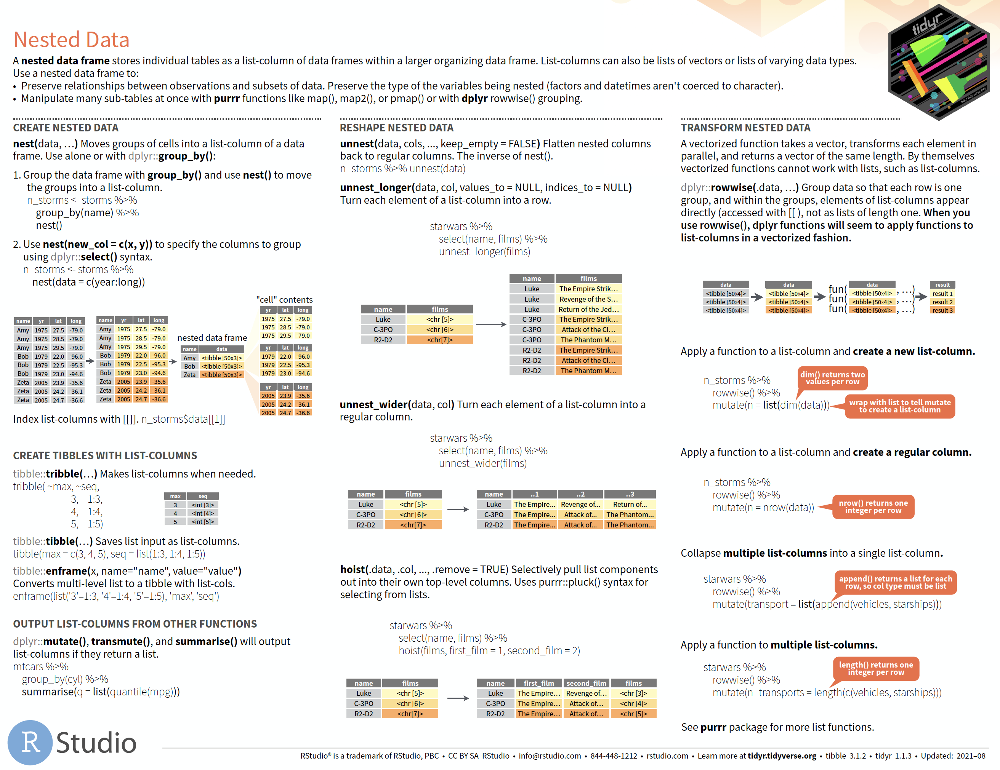

cheatsheet`r`
================

<!-- README.md is generated from README.Rmd. Please edit that file -->

# Welcome to `cheatsheetr`!

<!-- badges: start -->
<!-- badges: end -->

The goal of `cheatsheetr` is to provide R exercises from RStudio’s
excellent cheatsheets.

## Installation

You can install the development version of `cheatsheetr` like so:

``` r
# install.packages("devtools")
devtools::install_github("mjfrigaard/cheatsheetr")
```

## Example

This is a basic example:

``` r
library(cheatsheetr)
library(learnr)
## basic example code
learnr::run_tutorial("import", package = "cheatsheetr")
```

# Cheatsheet tutorials

Below are the tutorials based on the cheatsheet contents.

## Import

These exercises cover the **Data import with `readr`, `readxl`, and
`googlesheets4` cheatsheet** cheatsheet. Download it
[here](https://raw.githubusercontent.com/rstudio/cheatsheets/main/data-import.pdf).


``` r
## run local
learnr::run_tutorial("import", package = "cheatsheetr")
```

[Click here](https://mjfrigaard.shinyapps.io/import/) to run in your
browser.

## Tidy

The **Data tidying with `tidyr` cheatsheet** is broken into two parts.
Read more about the [`tidyr` package](https://tidyr.tidyverse.org/),
which is designed to *help you create tidy data.* Download the
cheatsheet
[here](https://raw.githubusercontent.com/rstudio/cheatsheets/main/tidyr.pdf).

### Part 1



``` r
## run local
learnr::run_tutorial("tidyr-p1", package = "cheatsheetr")
```

[Click here](https://mjfrigaard.shinyapps.io/tidyr-p1/) to run in your
browser.

### Part 2

Nested data (*coming soon!*)



# Extra tutorials

Below are additional topics not covered in the RStudio cheatsheets:

## Command-line intro

These exercises don’t come from a cheatsheet, but they do cover some
common command-line tools worth knowing.

``` r
## run local
learnr::run_tutorial("commandline", package = "cheatsheetr")
```

[Click here](https://mjfrigaard.shinyapps.io/command-line/) to run in
your browser.

## Atomic vectors

This provides a brief introduction to R’s most common object: the
vector.

``` r
## run local
learnr::run_tutorial("atomic-vectors", package = "cheatsheetr")
```

[Click here](https://mjfrigaard.shinyapps.io/atomic-vectors/) to run in
your browser.

## S3 vectors

This introduces more complex vectors (factors, dates, date-times and
difftimes).

``` r
## run local
learnr::run_tutorial("S3-vectors", package = "cheatsheetr")
```

[Click here](https://mjfrigaard.shinyapps.io/S3-vectors/) to run in your
browser.

## `data.frame`s

An introduction to rectangular (spreadsheet) data in R.

``` r
## run local
learnr::run_tutorial("dataframes", package = "cheatsheetr")
```

[Click here](https://mjfrigaard.shinyapps.io/dataframes/) to run in your
browser.

> *More to come!*
